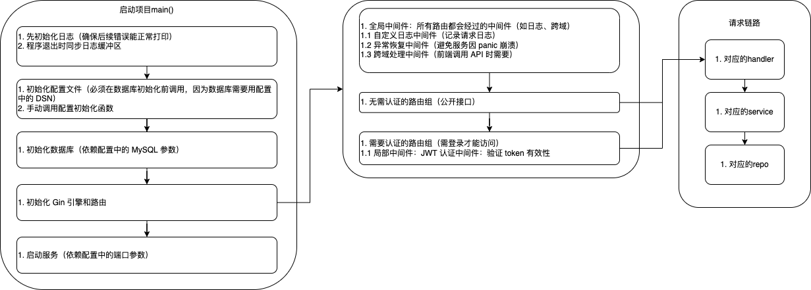

# go-my-blog
基于Go 语言结合 Gin 框架和 GORM 库开发一个个人博客系统的后端，实现博客文章的基本管理功能，包括文章的创建、读取、更新和删除（CRUD）操作，同时支持用户认证和简单的评论功能。

# 一、项目结构设计
blog-backend/
├── main.go                  # 程序入口
├── go.mod                   # 依赖管理
├── go.sum
├── config/                  # 配置相关
│   ├── config.go            # 配置读取
│   └── app.yaml             # 配置文件
├── internal/                # 内部业务逻辑
│   ├── model/               # 数据模型
│   │   ├── user.go
│   │   ├── post.go
│   │   └── comment.go
│   ├── repo/                # 数据访问层
│   │   ├── user.go
│   │   ├── post.go
│   │   └── comment.go
│   ├── service/             # 业务逻辑层
│   │   ├── user.go
│   │   ├── post.go
│   │   └── comment.go
│   └── handler/             # 接口处理器
│       ├── user.go
│       ├── post.go
│       └── comment.go
├── pkg/                     # 公共工具
│   ├── db/                  # 数据库连接
│   ├── jwt/                 # JWT工具
│   ├── logger/              # 日志工具
│   └── utils/               # 通用工具（密码加密等）
└── router/                  # 路由配置
└── router.go

# 二、项目功能
🔐 用户注册登录系统（JWT认证） 

📝 文章的创建、更新、查询和列表

💬 文章评论功能

🗄️ MySQL数据库存储

🔧 灵活的配置管理

🚀 高性能的Gin Web框架

# 三、技术栈
- Web框架: Gin

- ORM: GORM

- 数据库: MySQL

- 认证: JWT

- 日志: Zap

- 配置: YAML + 环境变量

- 密码加密: bcrypt

- 仓库管理：Git

# 四、运行环境
- Go 1.25.1

- MySQL 9.4.0

# 五、创建和初始化项目
```bash
  go mod init go-my-blog
```

## 安装依赖
### Web框架
```bash
  go get github.com/gin-gonic/gin@v1.9.1
```
### ORM
```bash
  go get gorm.io/gorm@v1.25.3
  go get gorm.io/driver/mysql@v1.5.2
```
### JWT
```bash
  go get github.com/golang-jwt/jwt/v5@v5.2.2
```
### 日志
```bash
  go get go.uber.org/zap@v1.26.0
```
### 配置管理
```bash
  go get github.com/spf13/viper@v1.17.0
```
### 密码加密
```bash
  go get golang.org/x/crypto@v0.36.0
```

# 六、数据库设计与模型定义
```sql
-- 创建my-blog数据库，若不存在则创建
CREATE DATABASE IF NOT EXISTS my_blog
    CHARACTER SET utf8mb4
    COLLATE utf8mb4_unicode_ci;
-- 通用排序规则，支持多语言且兼容性好

-- 切换到my_blog数据库（后续操作基于此库）
USE my_blog;
```
## users 表
##### users 表：存储用户信息，包括 id 、 username 、 password 、 email 等字段。
```sql
CREATE TABLE `users` (
                         `id` bigint NOT NULL AUTO_increment COMMENT '用户唯一标识',
                         `username` varchar(50) NOT NULL COMMENT '用户名（唯一）',
                         `password` varchar(100) NOT NULL COMMENT '加密存储的密码',
                         `email` varchar(100) NOT NULL COMMENT '邮箱（唯一）',
                         `created_at` datetime(3) NOT NULL COMMENT '创建时间',
                         `updated_at` datetime(3) NOT NULL COMMENT '更新时间',
                         `deleted_at` datetime(3) DEFAULT NULL COMMENT '软删除标记',
                         PRIMARY KEY (`id`),
                         UNIQUE INDEX `idx_username` (`username`),  -- 用户名唯一索引
                         UNIQUE INDEX `idx_email` (`email`),        -- 邮箱唯一索引
                         INDEX `idx_users_deleted_at` (`deleted_at`)  -- 软删除索引（优化查询已删除/未删除数据）
) ENGINE=InnoDB DEFAULT CHARSET=utf8mb4 COMMENT='用户表';
```
## posts 表
##### posts 表：存储博客文章信息，包括 id 、 title 、 content 、 user_id （关联 users 表的 id ）、 created_at 、 updated_at 等字段。
```sql
CREATE TABLE `posts` (
                         `id` bigint NOT NULL AUTO_INCREMENT COMMENT '文章唯一标识',
                         `title` varchar(200) NOT NULL COMMENT '文章标题',
                         `content` text NOT NULL COMMENT '文章内容',
                         `user_id` bigint NOT NULL COMMENT '作者ID',
                         `created_at` datetime(3) NOT NULL COMMENT '创建时间',
                         `updated_at` datetime(3) NOT NULL COMMENT '更新时间',
                         `deleted_at` datetime(3) DEFAULT NULL COMMENT '软删除标记',
                         PRIMARY KEY (`id`),
                         INDEX `idx_title` (`title`),                -- 标题索引（优化按标题搜索）
                         INDEX `idx_post_user` (`user_id`),          -- 作者ID索引（优化查询用户的文章）
                         INDEX `idx_posts_deleted_at` (`deleted_at`), -- 软删除索引
    -- 外键约束：关联用户表（级联删除，删除用户时自动删除其文章）
                         CONSTRAINT `fk_post_user` FOREIGN KEY (`user_id`) REFERENCES `users` (`id`) ON DELETE CASCADE
) ENGINE=InnoDB DEFAULT CHARSET=utf8mb4 COMMENT='文章表';
```
## comments 表
##### comments 表：存储文章评论信息，包括 id 、 content 、 user_id （关联 users 表的 id ）、 post_id （关联 posts 表的 id ）、 created_at 等字段。
```sql
CREATE TABLE `comments` (
                            `id` bigint NOT NULL AUTO_INCREMENT COMMENT '评论唯一标识',
                            `content` text NOT NULL COMMENT '评论内容',
                            `user_id` bigint NOT NULL COMMENT '评论者ID',
                            `post_id` bigint NOT NULL COMMENT '所属文章ID',
                            `created_at` datetime(3) NOT NULL COMMENT '创建时间',
                            `updated_at` datetime(3) NOT NULL COMMENT '更新时间',
                            `deleted_at` datetime(3) DEFAULT NULL COMMENT '软删除标记',
                            PRIMARY KEY (`id`),
                            INDEX `idx_comment_user` (`user_id`),       -- 评论者ID索引（优化查询用户的评论）
                            INDEX `idx_comment_post` (`post_id`),       -- 文章ID索引（核心，优化查询文章的评论）
                            INDEX `idx_comments_deleted_at` (`deleted_at`), -- 软删除索引
    -- 外键约束：关联用户表（级联删除）
                            CONSTRAINT `fk_comment_user` FOREIGN KEY (`user_id`) REFERENCES `users` (`id`) ON DELETE CASCADE,
    -- 外键约束：关联文章表（级联删除，删除文章时自动删除其评论）
                            CONSTRAINT `fk_comment_post` FOREIGN KEY (`post_id`) REFERENCES `posts` (`id`) ON DELETE CASCADE
) ENGINE=InnoDB DEFAULT CHARSET=utf8mb4 COMMENT='评论表';
```

## Go 模型结构体

```go
package model

import (
	"time"

	"gorm.io/gorm"
)

// User 用户模型
type User struct {
	ID        uint           `gorm:"type:bigint;primaryKey;autoIncrement;comment:用户唯一标识" json:"id"`
	Username  string         `gorm:"type:varchar(50);not null;uniqueIndex:idx_username;comment:用户名（唯一）" json:"username"`
	Password  string         `gorm:"type:varchar(100);not null;comment:加密存储的密码" json:"password"`
	Email     string         `gorm:"type:varchar(100);not null;uniqueIndex:idx_email;comment:邮箱（唯一）" json:"email"`
	CreatedAt time.Time      `gorm:"comment:创建时间" json:"created_at"`
	UpdatedAt time.Time      `gorm:"comment:更新时间" json:"updated_at"`
	DeletedAt gorm.DeletedAt `gorm:"comment:软删除标记" json:"deleted_at"`
	// 添加 OnDelete:CASCADE，与 SQL 级联删除逻辑对齐
	Posts    []Post    `gorm:"foreignKey:UserID;constraint:OnDelete:CASCADE" json:"posts"`
	Comments []Comment `gorm:"foreignKey:UserID;constraint:OnDelete:CASCADE" json:"comments"`
}


// Post 文章模型
type Post struct {
	ID        uint           `gorm:"type:bigint;primaryKey;autoIncrement;comment:文章唯一标识" json:"id"`
	Title     string         `gorm:"type:varchar(200);not null;index:idx_title;comment:文章标题" json:"title"`
	Content   string         `gorm:"type:text;not null;comment:文章内容" json:"content"`
	UserID    uint           `gorm:"type:bigint;not null;index:idx_post_user;comment:作者ID" json:"user_id"`
	CreatedAt time.Time      `gorm:"comment:创建时间" json:"created_at"`
	UpdatedAt time.Time      `gorm:"comment:更新时间" json:"updated_at"`
	DeletedAt gorm.DeletedAt `gorm:"comment:软删除标记" json:"deleted_at"`
	// 关联作者：无需级联（删除文章不影响用户），保持不变
	User     User      `gorm:"foreignKey:UserID" json:"user"`
	// 关键修改：添加 OnDelete:CASCADE，与 SQL 级联删除逻辑对齐
	Comments []Comment `gorm:"foreignKey:PostID;constraint:OnDelete:CASCADE" json:"comments"`
}

// Comment 评论模型
type Comment struct {
	ID        uint           `gorm:"type:bigint;primaryKey;autoIncrement;comment:评论唯一标识" json:"id"`
	Content   string         `gorm:"type:text;not null;comment:评论内容" json:"content"`        
	UserID    uint           `gorm:"type:bigint;not null;index:idx_comment_user;comment:评论者ID" json:"user_id"`
	PostID    uint           `gorm:"type:bigint;not null;index:idx_comment_post;comment:所属文章ID" json:"post_id"` 
	CreatedAt time.Time      `gorm:"comment:创建时间" json:"created_at"`
	UpdatedAt time.Time      `gorm:"comment:更新时间" json:"updated_at"`
	DeletedAt gorm.DeletedAt `gorm:"comment:软删除标记" json:"-"`
	// 关联关系：评论的作者和所属文章
	User User `gorm:"foreignKey:UserID" json:"user"` // 预加载评论者信息
	Post Post `gorm:"foreignKey:PostID" json:"post"` // 可选：关联文章信息
}

```
# 链路图


# 配置文件数据库连接
```yaml
# 数据库配置（MySQL）
mysql:
  # 数据库连接串（格式：用户名:密码@tcp(IP:端口)/数据库名?参数）
  dsn: "root:your_password@tcp(127.0.0.1:3306)/my_blog?charset=utf8mb4&parseTime=True&loc=Local"
  # 连接池配置：最大打开连接数（避免连接过多导致数据库压力）
  max_open_conns: 100
  # 连接池配置：最大空闲连接数（保留部分连接，避免频繁创建销毁）
  max_idle_conns: 20
  # 连接池配置：连接最大存活时间（避免长期闲置连接失效）
  conn_max_lifetime_hour: 1
  # 是否开启 SQL 日志（开发环境 true，生产环境 false）
  log_mode: true

# 服务端口
server:
  port: 8080
```

# 启动应用


# 用户认证与授权
 - 实现用户注册和登录功能，用户注册时需要对密码进行加密存储，登录时验证用户输入的用户名和密码。
 - 使用 JWT（JSON Web Token）实现用户认证和授权，用户登录成功后返回一个 JWT，后续的需要认证的接口需要验证该 JWT 的有效性。

# 文章管理功能
实现文章的创建功能，只有已认证的用户才能创建文章，创建文章时需要提供文章的标题和内容。
实现文章的读取功能，支持获取所有文章列表和单个文章的详细信息。
实现文章的更新功能，只有文章的作者才能更新自己的文章。
实现文章的删除功能，只有文章的作者才能删除自己的文章。
# 评论功能
实现评论的创建功能，已认证的用户可以对文章发表评论。
实现评论的读取功能，支持获取某篇文章的所有评论列表。
# 错误处理与日志记录
对可能出现的错误进行统一处理，如数据库连接错误、用户认证失败、文章或评论不存在等，返回合适的 HTTP 状态码和错误信息。
使用日志库记录系统的运行信息和错误信息，方便后续的调试和维护。